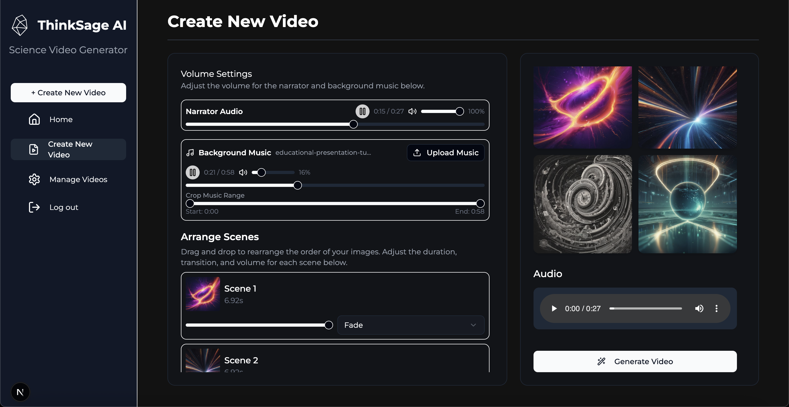

# ThinkSage AI

## Overview

ThinkSage AI is an advanced AI-powered platform that automates the creation of educational and scientific content videos. The system combines multiple AI technologies to transform scientific data into engaging video content, making complex information accessible and engaging for various audiences.

## Description

ThinkSage AI is a comprehensive solution that streamlines the process of creating educational videos from scientific content. The platform automatically collects data from reliable sources (Wikipedia, Nature, PubMed), processes it through various AI models, and generates professional-quality videos with synchronized audio, visuals, and effects. The system is designed to be both powerful and user-friendly, allowing for both automated and manual customization of content.

## Information & Contact

- Course: HCMUS - CSC13010
- Project: ThinkSage AI
- Team Members:

| No. | Student ID | Full Name           | Email                       |
| --- | ---------- | ------------------- | --------------------------- |
| 1   | 22127152   | Lê Gia Huy          | lghuy22@clc.fitus.edu.vn    |
| 2   | 22127203   | Võ Ngọc Khoa        | vnkhoa22@clc.fitus.edu.vn   |
| 3   | 22127031   | Nguyễn Duy Bảo      | ndbao22@clc.fitus.edu.vn    |
| 4   | 22127193   | Vũ Nguyễn Gia Khiêm | vngkhiem22@clc.fitus.edu.vn |

## Screenshots





## Features

### Core Features

1. **Scientific Data Collection**

   - Automated web crawling from Wikipedia, Nature, and PubMed
   - Python-based crawler for efficient data collection and analysis
   - Support for open-source API integration

2. **AI-Powered Script Generation**

   - OpenAI API integration for automated script creation
   - Content customization based on target audience
   - Intelligent content structuring and formatting

3. **Text-to-Speech Synthesis**

   - AiguruLab API integration for high-quality voice synthesis
   - Multiple voice options and languages
   - Natural-sounding speech generation

4. **AI Image & Video Generation**

   - Multi-step AI processing pipeline:
     1. Data collection from scientific sources
     2. Content summarization using OpenAI/Gemini
     3. Image generation with DeepSeek/Gemini
     4. Video rendering with Remotion

5. **Video Production Pipeline**

   - Automated audio-visual synchronization
   - Professional transitions and effects
   - High-quality output with customizable settings

6. **Dashboard & Video Management**
   - Comprehensive video creation interface
   - Video status tracking (pending, processing, completed)
   - Convex-based data storage and management

### Advanced Features

1. **Manual Content Editing**

   - Script modification capabilities
   - Image customization options
   - Voice-over adjustments
   - Real-time preview functionality

2. **Performance Analytics**

   - YouTube integration for view statistics
   - Real-time analytics dashboard
   - Auto-refresh every 5 minutes
   - Customizable reporting

3. **Content Personalization**

   - Target audience-based content adaptation
   - Google Gemini AI integration for style customization
   - Custom prompt engineering

4. **Voice Recording & Captioning**

   - Human voice recording per scene
   - Automatic caption generation
   - Reading speed-based timing

5. **Multi-AI Integration**

   - OpenAI for language processing
   - Gemini for image generation
   - DeepSeek for illustrations
   - Aigurulab for voice synthesis

6. **Social Media Integration**
   - Direct YouTube publishing
   - OAuth2 authentication
   - Video link management

### User Interface

- Modern, responsive design using shadcn/ui and TailwindCSS
- Dark mode support
- Optimized for desktop and tablet devices
- Consistent layout and intuitive navigation
- Real-time preview capabilities

### Quality Features

- Synchronized audio-visual content
- Professional transitions and effects
- High-resolution output
- Natural scene transitions
- Clear and readable captions

## Tech Stack

### Frontend

![Next.js][Next.js] ![TailwindCSS][TailwindCSS] ![shadcn][shadcn]
![Remotion][Remotion] ![Firebase][Firebase] ![Convex][Convex]
![Recharts][Recharts]

### Backend

![Node.js][Node.js] ![Python][Python] ![Convex][Convex]
![Inngest][Inngest] ![Deepgram][Deepgram] ![Google][Google]
![OpenAI][OpenAI] ![Gemini][Gemini] ![DeepSeek][DeepSeek]
![Aigurulab][Aigurulab]

### Development Tools

![ESLint][ESLint] ![Prettier][Prettier]
![Husky][Husky] ![Docker][Docker]

<!-- MARKDOWN LINKS & IMAGES -->

[Next.js]: https://img.shields.io/badge/next.js-000000?style=for-the-badge&logo=nextdotjs&logoColor=white
[TailwindCSS]: https://img.shields.io/badge/Tailwind_CSS-38B2AC?style=for-the-badge&logo=tailwind-css&logoColor=white
[shadcn]: https://img.shields.io/badge/shadcn-000000?style=for-the-badge&logo=shadcnui&logoColor=white
[Remotion]: https://img.shields.io/badge/Remotion-000000?style=for-the-badge&logo=remotion&logoColor=white
[Firebase]: https://img.shields.io/badge/Firebase-FFCA28?style=for-the-badge&logo=firebase&logoColor=black
[Convex]: https://img.shields.io/badge/Convex-000000?style=for-the-badge&logo=convex&logoColor=white
[Recharts]: https://img.shields.io/badge/Recharts-000000?style=for-the-badge&logo=recharts&logoColor=white
[Node.js]: https://img.shields.io/badge/Node.js-339933?style=for-the-badge&logo=nodedotjs&logoColor=white
[Python]: https://img.shields.io/badge/Python-3776AB?style=for-the-badge&logo=python&logoColor=white
[Inngest]: https://img.shields.io/badge/Inngest-000000?style=for-the-badge&logo=inngest&logoColor=white
[Deepgram]: https://img.shields.io/badge/Deepgram-000000?style=for-the-badge&logo=deepgram&logoColor=white
[Google]: https://img.shields.io/badge/Google-4285F4?style=for-the-badge&logo=google&logoColor=white
[OpenAI]: https://img.shields.io/badge/OpenAI-412991?style=for-the-badge&logo=openai&logoColor=white
[Gemini]: https://img.shields.io/badge/Gemini-000000?style=for-the-badge&logo=gemini&logoColor=white
[DeepSeek]: https://img.shields.io/badge/DeepSeek-000000?style=for-the-badge&logo=deepseek&logoColor=white
[Aigurulab]: https://img.shields.io/badge/Aigurulab-000000?style=for-the-badge&logo=aigurulab&logoColor=white
[ESLint]: https://img.shields.io/badge/ESLint-4B32C3?style=for-the-badge&logo=eslint&logoColor=white
[Prettier]: https://img.shields.io/badge/Prettier-F7B93E?style=for-the-badge&logo=prettier&logoColor=black
[Husky]: https://img.shields.io/badge/Husky-000000?style=for-the-badge&logo=husky&logoColor=white
[Docker]: https://img.shields.io/badge/Docker-2496ED?style=for-the-badge&logo=docker&logoColor=white

## Building and Usage

### Prerequisites

- Node.js (v18 or higher)
- Python 3.8+
- npm (comes with Node.js)
- pip (Python package manager)
- Docker Desktop
- ffmpeg (for human voice recording feature)
- Git

### Installation

#### Part 1: Frontend Setup

1. Clone the repository:

```bash
git clone https://github.com/legiahuy/csc13010-thinksage-ai.git
cd csc13010-thinksage-ai
```

2. Navigate to the frontend directory:

```bash
cd ./frontend
```

3. Set up environment files:

```bash
# Create environment files from samples
cp .env.sample .env
cp .env.local.sample .env.local
```

Edit both `.env` and `.env.local` files to update configuration settings according to your environment.

4. Install dependencies:

```bash
npm install
```

5. Start Convex (realtime database):

```bash
npx convex dev
```

6. Start Inngest (background jobs):

```bash
npx inngest-cli@latest dev
```

7. Start the application:

```bash
npm run dev
```

The application will be available at http://localhost:3000

8. Build Docker image for video rendering:

```bash
# Make sure Docker Desktop is running
./build-docker.ps1  # For Windows
./build-docker.sh   # For Unix-based systems
```

9. Install ffmpeg for human voice recording:

- Follow the installation guide at: https://www.youtube.com/watch?v=JR36oH35Fgg

#### Part 2: Crawler Service Setup

1. Navigate to the crawler directory:

```bash
cd ./crawler
```

2. Create and activate virtual environment:

For Windows:

```bash
python -m venv env
.\env\Scripts\activate
```

For Mac/Linux:

```bash
python3 -m venv env
source env/bin/activate
```

3. Install required Python packages:

```bash
pip install fastapi uvicorn nltk requests beautifulsoup4 wikipedia pubmed_parser scikit-learn pandas python-dotenv springernature-api-client
```

4. Download NLTK data:

```python
import nltk
nltk.download('punkt')
nltk.download('stopwords')
nltk.download('punkt_tab')
exit()
```

5. Start the crawler server:

```bash
uvicorn server:app --reload
```

The crawler API will be available at http://127.0.0.1:8000

### Environment Variables

Create and configure the following environment files:

1. Frontend `.env`:

```
REMOTION_GCP_PRIVATE_KEY=
REMOTION_GCP_CLIENT_EMAIL=
REMOTION_GCP_PROJECT_ID=

GCP_SERVICE_URL=
GCP_SERVE_URL =

INPUT_PROPS_PATH=
```

2. Frontend `.env.local`:

```
NEXT_PUBLIC_FIREBASE_API_KEY =

CONVEX_DEPLOYMENT=

NEXT_PUBLIC_CONVEX_URL=
NEXT_PUBLIC_AIGURULAB_API_KEY=
NEXT_PUBLIC_GEMINI_API_KEY=
NEXT_PUBLIC_DEEPGRAM_API_KEY=

NEXT_PUBLIC_CLOUDINARY_CLOUD_NAME=
NEXT_PUBLIC_CLOUDINARY_API_KEY=
CLOUDINARY_API_SECRET=

NEXT_PUBLIC_OPENAI_API_KEY=
NEXT_PUBLIC_OPENROUTER_API_KEY=

YOUTUBE_CLIENT_ID=
YOUTUBE_CLIENT_SECRET=
YOUTUBE_REDIRECT_URI=
```

3. Crawler `.env`:

```
PUBMED_API_KEY=
NATURE_API_KEY=
SPRINGER_API_KEY=
```

### Docker Deployment

The project includes Docker support for containerized deployment:

```bash
# Build the Docker image
./build-docker.ps1  # For Windows
./build-docker.sh   # For Unix-based systems

# Run the container
docker run -p 3000:3000 thinksage-ai
```

## Project Structure

```
├── frontend/           # Next.js frontend application
│   ├── app/           # Next.js app directory
│   ├── components/    # React components
│   ├── public/        # Static assets
│   └── remotion/      # Video rendering components
├── convex/            # Backend functions and database
├── crawler/           # Python-based web crawler
│   ├── src/          # Crawler source code
│   └── requirements.txt # Python dependencies
└── .husky/           # Git hooks configuration
```

## Credits & Inspiration

This project was inspired by and built upon the concepts and architecture demonstrated in [AI Video Generator with Next.js, OpenAI, and Remotion](https://www.youtube.com/watch?v=uBgFPmieR6M). We've extended the original implementation with additional features including:

- Enhanced scientific content processing
- Multi-source data crawling
- Advanced AI model integration
- Extended video customization options
- Improved user interface and experience
